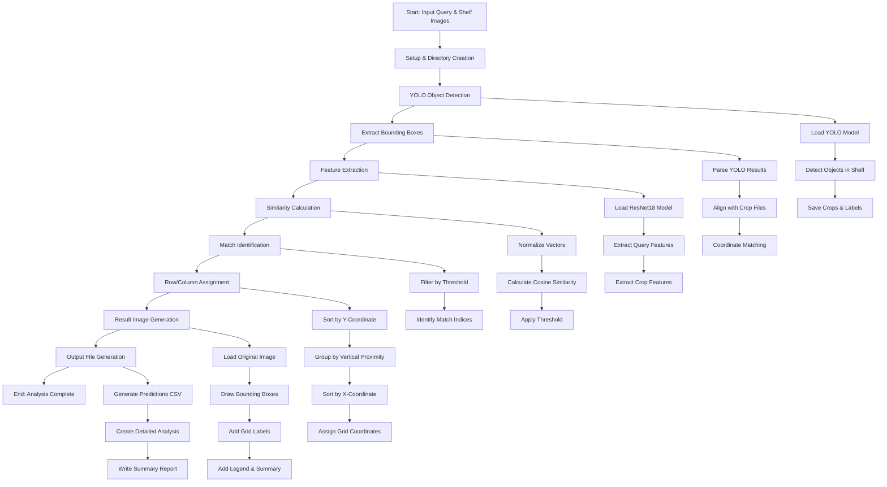

# Shelf Product Identifier - System Flowchart

## Complete System Architecture



## Detailed Process Flow

### 1. Input Processing

```
Input: query_image.jpg, shelf_image.jpg, threshold=0.85
↓
Create timestamped output directory
↓
Validate input files exist
```

### 2. Object Detection Pipeline

```
Load YOLO model (models/best.pt)
↓
Detect objects with confidence > 0.5
↓
Save individual product crops
↓
Save bounding box coordinates
↓
Extract detection results for alignment
```

### 3. Feature Extraction Pipeline

```
Load ResNet18 feature extractor
↓
Extract 512-dim features from query image
↓
Crop shelf image using bounding boxes
↓
Extract 512-dim features from each crop
↓
Normalize all feature vectors
```

### 4. Similarity Analysis Pipeline

```
Calculate cosine similarity between query and each crop
↓
Sort similarities in descending order
↓
Apply threshold (default: 0.85)
↓
Identify matching products
↓
Generate match statistics
```

### 5. Grid Organization Pipeline

```
Sort bounding boxes by Y-coordinate (top-to-bottom)
↓
Group products by vertical proximity
↓
Sort each row by X-coordinate (left-to-right)
↓
Assign R{row}C{column} coordinates
↓
Calculate row/column statistics
```

### 6. Visualization Pipeline

```
Load original shelf image
↓
Draw bounding boxes:
  - Green (thick): Matches with similarity scores
  - Red (thin): Non-matches
↓
Add grid labels (R1C1, R2C5, etc.)
↓
Add legend and summary statistics
↓
Save result image
```

### 7. Output Generation Pipeline

```
Generate predictions.csv:
  - identifier, match, row, column, similarity
↓
Create detailed_analysis.txt:
  - Row-by-row breakdown
  - Individual product details
↓
Write summary.txt:
  - Overall statistics
  - Row-by-row statistics
  - Match locations
```

## Key Decision Points

### Alignment Strategy

```
YOLO Results Available? → Yes → Use Direct Results
                    ↓
                    No → Parse Label Files
                    ↓
                    Fallback → Order-based Matching
```

### Row Assignment

```
Products in Same Y-Range? → Yes → Same Row
                       ↓
                       No → New Row
                       ↓
                       Sort by X-Coordinate
```

### Match Classification

```
Similarity >= Threshold? → Yes → Match (Green Box)
                      ↓
                      No → No Match (Red Box)
```

## Error Handling

### Numerical Stability

```
Cosine Similarity Fails? → Yes → Manual Calculation
                      ↓
                      No → Continue
```

### File Validation

```
Input Files Exist? → No → Error & Exit
                ↓
                Yes → Continue
```

### Detection Validation

```
YOLO Detections Found? → No → Error & Exit
                     ↓
                     Yes → Continue
```

## Performance Metrics

### Processing Time

- YOLO Detection: ~2-5 seconds
- Feature Extraction: ~1-3 seconds per image
- Similarity Calculation: ~0.1 seconds
- Visualization: ~0.5 seconds

### Memory Usage

- Model Loading: ~500MB (YOLO + ResNet18)
- Feature Vectors: ~85 × 512 × 4 bytes
- Image Processing: ~10-50MB per image

### Accuracy Metrics

- Detection Accuracy: Based on YOLO model performance
- Similarity Accuracy: Cosine similarity with ResNet18 features
- Grid Accuracy: Manual verification of row/column assignment

## Output Structure

```
output/
└── run_YYYYMMDD_HHMMSS/
    ├── result.jpg              # Visual result with highlights
    ├── predictions.txt         # CSV with all products
    ├── detailed_analysis.txt   # Row-by-row breakdown
    ├── summary.txt            # Overall statistics
    └── retail/                # YOLO output directory
        ├── crops/object/      # Individual product crops
        └── labels/           # Bounding box coordinates
```

## Configuration Options

### Detection Parameters

- Confidence Threshold: 0.5 (YOLO)
- Similarity Threshold: 0.85 (User-defined)
- Model Path: models/best.pt

### Processing Options

- Save Crops: True
- Save Labels: True
- Verbose Output: False

### Visualization Options

- Match Color: Green (0, 255, 0)
- No-Match Color: Red (0, 0, 255)
- Grid Label Color: Yellow (255, 255, 0)
- Box Thickness: 3 (matches), 1 (non-matches)
